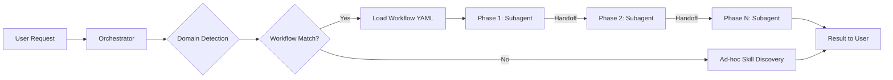

# ai-resources

Resource kit for AI coding agents: skills, workflows, orchestration rules, agent roles, and the **`ai-resources`** CLI. Works with **Cursor, Claude Code, Gemini CLI, Codex, GitHub Copilot, Windsurf, Continue.dev, Aider, and OpenCode**.

**v1.0 highlight:** multi-model orchestration via LiteLLM — each subagent role can run on a different LLM (Claude, Gemini, GPT, Vertex, Ollama). See [docs/multi-model.md](docs/multi-model.md).

## Install

Requirement: **Homebrew**.

By default, Homebrew resolves `brew tap user/name` as `github.com/user/homebrew-name`, not `user/name`. That's why you must specify the actual repo URL:

```bash
brew tap wildbitca/ai-resources https://github.com/wildbitca/ai-resources.git
brew install ai-resources
```

Verify: `ai-resources --help`

**Upgrade:** `brew update && brew upgrade ai-resources`

The formula is in **`Formula/ai-resources.rb`**. It declares **`python@3.12`**; the kit binary is typically **`python3.12`** (not always `python3`). If `ai-resources --help` fails, try `brew reinstall python@3.12` and reinstall the kit.

## Usage

| Command | Purpose |
|---------|---------|
| `ai-resources setup` | Interactive wizard: cockpit detection, LiteLLM gateway, providers, profiles, per-cockpit config. |
| `ai-resources doctor` | Full health check across config, credentials, gateway, cockpits, smoke tests. |
| `ai-resources executors show` | Display current role → model mapping. |
| `ai-resources executors edit` | Open `executors.yaml` in `$EDITOR`. |
| `ai-resources executors test <role>` | Round-trip a single role's model through the gateway. |
| `ai-resources daemon {start,stop,status,logs,update}` | Manage local LiteLLM container. |
| `ai-resources audit` | Cost report from gateway logs. |
| `ai-resources generate` | Regenerate skills index, import vendor skills. |
| `ai-resources version` | Print version. |

### First run

```sh
ai-resources setup       # wizard walks you through everything
ai-resources doctor      # verify
```

Choose **single-model** mode for the legacy single-provider behavior, or
**multi-model** for per-role routing via LiteLLM gateway.

After installing, the `AGENT_KIT` env var points to the kit on disk. Set `AGENT_SKILLS_ROOT` in your shell profile to the skills directory path shown by `ai-resources --help`.

---

## What's in the Kit

### Directory Map

```
ai-resources/
├── skills/                 # 116 reusable skill modules (SKILL.md each)
│   ├── common-*            # Language-agnostic skills (best practices, security, TDD, etc.)
│   ├── flutter-*           # Flutter/Dart-specific skills
│   ├── terraform-*         # Terraform/IaC skills
│   ├── gpm-curated-*       # Imported curated skills (Gentleman Programming)
│   ├── gpm-community-*     # Imported community skills
│   └── _shared/            # Shared conventions and contracts
├── workflows/              # 6 workflow definitions (YAML)
├── agents/
│   ├── roles/              # 14 base agent roles (domain-agnostic)
│   └── personas/           # 25 domain-specific personas (role x domain)
├── rules/                  # 22 orchestration rules (.mdc format)
├── templates/              # 6 project templates (ADR, spec, etc.)
├── scripts/                # CLI tooling (kit.py)
├── Formula/                # Homebrew formula
├── skills-index.json       # Auto-generated skill catalog (machine-readable)
├── resources.json          # Kit manifest (external skill sources, MCP config)
├── AGENTS.md               # Orchestration policy and skill discovery rules
└── CHANGELOG.md            # Release history
```

### Skills (`skills/`)

Each skill is a self-contained module with a `SKILL.md` file containing YAML frontmatter (`name`, `description`, `triggers`, `globs`) and detailed instructions. Skills are the primary unit of knowledge in the kit.

**Discovery:** Agents find skills through `skills-index.json` (auto-generated by `ai-resources generate`). The index contains `id`, `description`, `triggers`, and `path` for each skill, enabling agents to match the current task against available skills and load only what's relevant.

**Categories:**

| Prefix | Count | Domain |
|--------|-------|--------|
| `common-*` | ~25 | Language-agnostic (security, TDD, code review, architecture, etc.) |
| `flutter-*` | ~30 | Flutter/Dart development |
| `dart-*` | 3 | Dart language, tooling, best practices |
| `terraform-*` | 5 | Terraform/IaC modules, versioning, migrations |
| `gpm-curated-*` | 14 | Imported: Angular, React, Next.js, TypeScript, etc. |
| `gpm-community-*` | 6 | Imported: Electron, Elixir, Java, Spring Boot, etc. |
| Other | ~30 | Specialized (Cloudflare, Firebase, Sentry, ClickUp, etc.) |

### Workflows (`workflows/`)

Workflow YAML files define multi-phase execution pipelines. Each phase specifies a subagent type and the skills it should load. See [Orchestration Guide](docs/orchestration.md) for details and diagrams.

| Workflow | When to Use |
|----------|-------------|
| `_feature-template` | Implement a feature or multi-step task |
| `_bugfix-template` | Fix a bug or resolve broken behavior |
| `explore-and-plan` | Understand the codebase or plan before implementing |
| `cross-domain-backend-infra` | Changes spanning app and infrastructure |
| `release-dart-flutter` | Prepare a Dart/Flutter release |
| `security-devsecops` | Security audit, pen test, or vulnerability scan |

### Agent Roles (`agents/roles/`)

Base role definitions that tell subagents how to behave. Each role has a specific responsibility boundary.

| Role | Responsibility |
|------|---------------|
| `generalPurpose` | Multi-step reasoning, research, exploration |
| `planner` | Requirements analysis, task breakdown, acceptance criteria |
| `software-architect` | Architecture validation, design decisions, diagrams |
| `implementer` | Code changes — atomic edits following the plan |
| `tester` | Write and run tests, coverage analysis |
| `code-reviewer` | Code review against standards and security |
| `security-auditor` | SAST, DAST, dependency scanning, exploit validation |
| `verifier` | Final validation, spec updates, SDD closure |
| `explore` | Codebase discovery and pattern finding |
| `terraform-maintainer` | Terraform module lifecycle |
| `crashlytics-fixer` | Firebase Crashlytics triage |
| `sentry-fixer` | Sentry error triage |
| `package-upgrade` | Dependency upgrade workflow |
| `crossplane-upjet-maintainer` | Crossplane infrastructure |

### Agent Personas (`agents/personas/`)

Domain-specific variants combining a role with a technology domain. For example, `implementer-dart-flutter.md` is an implementer specialized in Flutter. Available domains: **angular**, **api-platform**, **dart-flutter**, **devops**, **symfony**.

### Rules (`rules/`)

Orchestration rules in `.mdc` format (Cursor Rules). These define how the orchestrator selects workflows, delegates to subagents, manages handoffs, and enforces constraints like token economics and security.

Key rules:
- `010-orchestrator.mdc` — Main orchestration loop
- `050-subagent-delegation.mdc` — When and how to delegate tasks
- `051-handoff-protocol.mdc` — Handoff file format between phases
- `100-token-economics.mdc` — Context window management

### Templates (`templates/`)

Project scaffolding templates:
- `adr.template.md` — Architecture Decision Record
- `feature-spec.template.md` — Feature specification
- `PROJECT.template.md` — Project metadata
- `mcp.json.template` — MCP server configuration

---

## Orchestration Overview

The kit uses a **workflow-driven orchestration** model where an AI agent acts as a router, delegating work to specialized subagents through defined phases.



Each workflow phase:
1. Loads a **persona** (role + domain) for the subagent
2. Resolves **skills** from `skills-index.json` and reads their `SKILL.md`
3. Dispatches work via the **Task tool** with a structured prompt
4. Passes context through a **handoff file** (`.agent-output/handoff-<branch>.md`)

For the full orchestration guide with detailed workflow diagrams, see **[docs/orchestration.md](docs/orchestration.md)**.

---

## Key Concepts

### Skill Discovery Protocol

Every supported agent receives a 5-step discovery recipe at setup time:

1. **Read** the `skills-index.json` catalog
2. **Match** the current task against each skill's `description` and `triggers`
3. **Load** matching `SKILL.md` files
4. **Apply** the skill's instructions (skill authority overrides generic patterns)
5. **No match?** Proceed normally

### Workflow Discovery Protocol

Before starting any non-trivial task, agents check if a workflow applies:

1. **Match** the user's request against workflow triggers
2. **Load** the full workflow YAML
3. **Follow** phases in order — workflows are the single source of truth for orchestration
4. **Handoff** between phases via structured handoff files

### Zero-Trust Engineering

- Loaded skills override pretraining patterns
- Always read `SKILL.md` — don't rely on memory alone
- Audit file writes against `common-feedback-reporter` when applicable

---

## Further Reading

| Document | Purpose |
|----------|---------|
| [Orchestration Guide](docs/orchestration.md) | Detailed workflow diagrams, agent roles, and handoff protocol |
| [AGENTS.md](AGENTS.md) | Orchestration policy and skill discovery rules |
| [CHANGELOG.md](CHANGELOG.md) | Release history |
| [workflows/WORKFLOW_CONTRACT.md](workflows/WORKFLOW_CONTRACT.md) | Workflow YAML specification |
