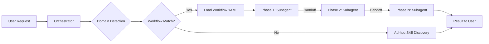

# ai-resources

Resource kit for AI coding agents: skills, workflows, orchestration rules, agent roles, and the **`ai-resources`** CLI. Works with **Cursor, Claude Code, Gemini CLI, Codex, GitHub Copilot, Windsurf, Continue.dev, Aider, and OpenCode**.

**v1.1 highlights:**
- **`--dry-run` for setup** — preview all generated configs and run live gateway smoke tests without writing anything to disk.
- **Teardown when switching modes** — multi-model → single-model (or vice versa) cleanly removes every artifact the wizard installed; pre-existing config is never touched.
- **OAuth + LiteLLM fix** — `allow_requests_on_db_unavailable: true` is auto-added to the gateway config so Claude Code OAuth session tokens pass through without a DB lookup error.
- **`quality-first` profile** — replaces `unified-default`; same routing strategy, clearer name.

**v1.0:** multi-model orchestration via LiteLLM — each subagent role can run on a different LLM (Claude, Gemini, GPT, Vertex, Ollama). See [docs/multi-model.md](docs/multi-model.md).

## Install

Requirement: **Homebrew**.

By default, Homebrew resolves `brew tap user/name` as `github.com/user/homebrew-name`, not `user/name`. That's why you must specify the actual repo URL:

```bash
brew tap wildbitca/ai-resources https://github.com/wildbitca/ai-resources.git
brew install ai-resources
```

Verify: `ai-resources --help`

**Upgrade:** `brew update && brew upgrade ai-resources`

The formula is in **`Formula/ai-resources.rb`**. It declares **`python@3.12`**; the kit binary is typically **`python3.12`** (not always `python3`). If `ai-resources --help` fails, try `brew reinstall python@3.12` and reinstall the kit.

## Usage

| Command | Purpose |
|---------|---------|
| `ai-resources setup` | Interactive wizard: cockpit detection, LiteLLM gateway, providers, profiles, per-cockpit config. |
| `ai-resources setup --dry-run` | Preview all generated configs + run live smoke tests without writing anything to disk. |
| `ai-resources setup --non-interactive` | Re-apply saved answers without prompting (useful in CI or scripted re-runs). |
| `ai-resources setup --profile <name>` | Skip profile prompt and use the named profile directly. |
| `ai-resources doctor` | Full health check across config, credentials, gateway, cockpits, smoke tests. |
| `ai-resources executors show` | Display current role → model mapping. |
| `ai-resources executors edit` | Open `executors.yaml` in `$EDITOR`. |
| `ai-resources executors test <role>` | Round-trip a single role's model through the gateway. |
| `ai-resources daemon {start,stop,status,logs,update}` | Manage local LiteLLM container. |
| `ai-resources audit` | Cost report from gateway logs. |
| `ai-resources generate` | Regenerate skills index, import vendor skills. |
| `ai-resources version` | Print version. |

### First run

```sh
ai-resources setup       # wizard walks you through everything
ai-resources doctor      # verify
```

Choose **single-model** mode for the legacy single-provider behavior, or
**multi-model** for per-role routing via LiteLLM gateway.

**Preview before committing:**
```sh
ai-resources setup --dry-run   # renders configs + runs smoke tests, writes nothing
```

**Switching modes later:**
Running `ai-resources setup` again and switching mode (e.g. multi-model → single-model) presents a confirmation list of tracked artifacts and removes only what the wizard installed. Pre-existing config files are never touched.

After installing, the `AGENT_KIT` env var points to the kit on disk. The wizard sets `AGENT_SKILLS_ROOT` automatically for each configured cockpit.

### Claude Code + OAuth

If Claude Code is in OAuth mode (`claude /login`), the wizard detects this and auto-adds `allow_requests_on_db_unavailable: true` to the LiteLLM gateway config. This lets Claude Code's session token pass through the local gateway without hitting a "db not found" error. Run `ai-resources doctor` to verify the setup is clean.

---

## What's in the Kit

### Directory Map

```
ai-resources/
├── skills/                 # 116 reusable skill modules (SKILL.md each)
│   ├── common-*            # Language-agnostic skills (best practices, security, TDD, etc.)
│   ├── flutter-*           # Flutter/Dart-specific skills
│   ├── terraform-*         # Terraform/IaC skills
│   ├── gpm-curated-*       # Imported curated skills (Gentleman Programming)
│   ├── gpm-community-*     # Imported community skills
│   └── _shared/            # Shared conventions and contracts
├── workflows/              # 16 workflow definitions (YAML) → generated workflow-* skills
├── hooks/                  # Claude Code hooks installed by setup (handoff guard, return format, stale handoffs)
├── profiles/               # Role → model profiles (claude-native/claude-inherit for single-model; LiteLLM profiles for multi-model)
├── agents/
│   ├── roles/              # 15 base agent roles (domain-agnostic)
│   └── personas/           # 25 domain-specific personas (role x domain)
├── rules/                  # Project-context and memory rules (.mdc format)
├── templates/              # 6 project templates (ADR, spec, etc.)
├── docs/                   # Guides (multi-model.md, orchestration.md, litellm-service.md)
├── scripts/
│   └── ai_resources/       # CLI package
│       ├── cli.py           # Argument parser + command dispatch
│       ├── generate.py      # skills-index.json builder + vendor importer
│       ├── daemon.py        # LiteLLM container lifecycle
│       ├── doctor.py        # Health check
│       ├── executors_cmd.py # Role → model map management
│       ├── audit.py         # Cost report
│       └── setup/           # Interactive wizard
│           ├── wizard.py    # Main wizard loop (9 steps)
│           ├── state.py     # SetupState + InstallTracking (audit trail for teardown)
│           ├── credentials.py
│           ├── litellm.py   # litellm.yaml / docker-compose.yaml generation
│           ├── providers.py # Provider model lists
│           ├── profiles.py  # Profile loader
│           ├── smoke.py     # Live gateway smoke tests
│           ├── detection.py # Cockpit auto-detection
│           ├── ui.py        # Rich/questionary UI helpers
│           └── cockpits/    # Per-cockpit configurators (claude, gemini, cursor, …)
├── Formula/                # Homebrew formula
├── skills-index.json       # Auto-generated skill catalog (machine-readable)
├── resources.json          # Kit manifest (external skill sources, MCP config)
├── AGENTS.md               # Orchestration policy and skill discovery rules
└── CHANGELOG.md            # Release history
```

### Skills (`skills/`)

Each skill is a self-contained module with a `SKILL.md` file containing YAML frontmatter (`name`, `description`, `triggers`, `globs`) and detailed instructions. Skills are the primary unit of knowledge in the kit.

**Discovery:** `ai-resources setup` links each skill into the agent's native skills directory (`~/.claude/skills/<id>`, `~/.agents/skills/<id>`), so agents see every skill's description and load a skill only when it matches. Tools without native skill discovery use `skills-index.json` (generated by `ai-resources generate`, paths relative to the kit root).

**Categories:**

| Prefix | Count | Domain |
|--------|-------|--------|
| `common-*` | ~25 | Language-agnostic (security, TDD, code review, architecture, etc.) |
| `flutter-*` | ~30 | Flutter/Dart development |
| `dart-*` | 3 | Dart language, tooling, best practices |
| `terraform-*` | 5 | Terraform/IaC modules, versioning, migrations |
| `gpm-curated-*` | 14 | Imported: Angular, React, Next.js, TypeScript, etc. |
| `gpm-community-*` | 6 | Imported: Electron, Elixir, Java, Spring Boot, etc. |
| Other | ~30 | Specialized (Cloudflare, Firebase, Sentry, ClickUp, etc.) |

### Workflows (`workflows/`)

Workflow YAML files define multi-phase execution pipelines. Each phase specifies a subagent type and the skills it should load. `ai-resources generate` exposes each workflow as a `workflow-<name>` skill whose description is the workflow's trigger, so agents pick workflows through native skill discovery; the `kit-orchestration` skill explains how to run them. See [Orchestration Guide](docs/orchestration.md) for diagrams.

Workflows: `feature-implementation`, `bugfix`, `refactor`, `explore-and-plan`, `cross-domain-backend-infra`, `merge-and-document`, `release-dart-flutter`, `security-devsecops`, `dependency-audit`, `ci-debug`, `incident-response`, `infra-triage`, `k8s-debug`, `log-triage`, `db-investigation`, `cloud-ops`.

### Deterministic core loop (`workflows/scripts/`)

Feature, bugfix and refactor work also ships as two [dynamic workflow](https://code.claude.com/docs/en/workflows) scripts, installed by setup into `~/.claude/workflows/`:

| Command | What it runs |
|---------|--------------|
| `/kit-plan <goal>` | Parallel readers (code, specs, tests and risk) → three planners with different biases → two judges → one plan file for you to approve |
| `/kit-implement` | One writer implementing with TDD → test gate with a bounded fix loop → three review lenses in parallel (correctness, security, test integrity) → a skeptic per finding → fix what survives → verifier signs off against the acceptance criteria |

The script holds the ordering, retries and fan-out, so they don't depend on the model following prose. A script can't ask you anything while it runs, which is why approval sits between the two commands.

### Profiles (`profiles/`)

Profiles define the role → model mapping for kit subagents. Setup offers the profiles that match the chosen mode.

| Profile | Mode | Strategy |
|---------|------|----------|
| `claude-native` | single-model | Claude aliases per role: Haiku to explore, Sonnet to implement/test/verify, Opus to plan/architect/review/audit |
| `claude-inherit` | single-model | Every role inherits the session model |

Multi-model (LiteLLM gateway) profiles:

| Profile | Strategy |
|---------|----------|
| `quality-first` | Balanced quality/cost — strong models for plan/review, fast models for exploration |
| `all-claude` | Every role uses a Claude model (Anthropic only) |
| `all-gemini` | Every role uses a Gemini model |
| `cost-optimized` | Cheapest viable model per role |

### Agent Roles (`agents/roles/`)

Base role definitions that tell subagents how to behave. Each role has a specific responsibility boundary.

| Role | Responsibility |
|------|---------------|
| `generalPurpose` | Multi-step reasoning, research, exploration |
| `planner` | Requirements analysis, task breakdown, acceptance criteria |
| `software-architect` | Architecture validation, design decisions, diagrams |
| `implementer` | Code changes — atomic edits following the plan |
| `tester` | Write and run tests, coverage analysis |
| `code-reviewer` | Code review against standards and security |
| `security-auditor` | SAST, DAST, dependency scanning, exploit validation |
| `verifier` | Final validation, spec updates, SDD closure |
| `doc-writer` | Specs, ADRs, postmortems from verified sources |
| `explore` | Codebase discovery and pattern finding |
| `terraform-maintainer` | Terraform module lifecycle |
| `crashlytics-fixer` | Firebase Crashlytics triage |
| `sentry-fixer` | Sentry error triage |
| `package-upgrade` | Dependency upgrade workflow |
| `crossplane-upjet-maintainer` | Crossplane infrastructure |

### Agent Personas (`agents/personas/`)

Domain-specific variants combining a role with a technology domain. For example, `implementer-dart-flutter.md` is an implementer specialized in Flutter. Available domains: **angular**, **api-platform**, **dart-flutter**, **devops**, **symfony**.

### Rules (`rules/`)

Project-context, memory and security rules in `.mdc` format (`000-project-bootstrap`, `012`/`013` specs entry, `014`/`300` Engram, `017` multi-model routing, `200` MCP security). Orchestration moved to skills:

- `kit-orchestration` — running workflow steps, delegation, handoff, parallel groups, subagent return format
- `delegate`, `setup-project`, `self-update`, `knowledge-audit` — slash commands

### Hooks (`hooks/`)

Installed into `~/.claude/settings.json` by setup (your own hooks are kept):

- `kit_session_start.py` (SessionStart) — reports in-progress or stale `.agent-output/handoff-*.md` files
- `kit_subagent_return.py` (SubagentStop) — during a workflow, sends a kit role subagent back if it did not end with the return block
- `kit_handoff_guard.py` (PreToolUse) — while `.agent-output/parallel-group.json` exists, blocks subagents from writing the shared handoff

### Install as a Claude Code plugin

The repository is also a plugin and its own marketplace (`.claude-plugin/`), so Claude Code can install the skills, role subagents, workflow scripts and hooks without the Homebrew CLI:

```shell
/plugin marketplace add wildbitca/ai-resources
/plugin install ai-resources@wildbit-ai-resources
```

Use the Homebrew CLI when you also want the wizard (`ai-resources setup`), multi-model routing, or the other cockpits; use the plugin when you only want the content in Claude Code. `claude plugin validate .` checks the manifests.

### Quality gates

| Command | What it checks |
|---------|----------------|
| `python3 scripts/validate_kit.py` | Skill frontmatter (valid YAML, name matches directory, description present and within budget), workflow steps (roles, skills, routing targets, parallel-group rules, verifier/document split), workflow script rules, hook compilation, `$AGENT_KIT` references, plugin manifests, vendored provenance, and that `skills-index.json` matches the tree |
| `claude plugin eval .` | Behaviour: whether the kit actually steers Claude on realistic prompts, scored against a no-plugin baseline (see `evals/`) |

CI runs the validator and the manifest check on every pull request (`.github/workflows/ci.yml`). Evals are run locally because they make real model calls.

### Vendored skills

Third-party skills are imported by `ai-resources generate` from the sources in `resources.json`, pinned to a commit `sha`. The import rewrites each skill's frontmatter `name` to its flat id and records the upstream revision in `.skill-source.yaml`. Bump the `sha` deliberately: these files are prompts that run inside your agent, so review the diff first.

### Templates (`templates/`)

Project scaffolding templates:
- `adr.template.md` — Architecture Decision Record
- `feature-spec.template.md` — Feature specification
- `PROJECT.template.md` — Project metadata
- `mcp.json.template` — MCP server configuration

---

## Orchestration Overview

The kit uses a **workflow-driven orchestration** model where an AI agent acts as a router, delegating work to specialized subagents through defined phases.


```mermaid
graph LR
    U[User Request] --> O[Orchestrator]
    O --> D{Domain Detection}
    D --> W{Workflow Match?}
    W -->|Yes| WF[Load Workflow YAML]
    W -->|No| SK[Ad-hoc Skill Discovery]
    WF --> P1[Phase 1: Subagent]
    P1 -->|Handoff| P2[Phase 2: Subagent]
    P2 -->|Handoff| PN[Phase N: Subagent]
    PN --> Done[Result to User]
    SK --> Done
```

Each workflow phase:
1. Loads a **persona** (role + domain) for the subagent
2. Names the step's **skills** (`skills/<id>/SKILL.md`) for the subagent to read first
3. Dispatches work to the role subagent with a complete prompt
4. Passes context through a **handoff file** (`.agent-output/handoff-<branch>.md`)

For the full orchestration guide with detailed workflow diagrams, see **[docs/orchestration.md](docs/orchestration.md)**.

---

## Key Concepts

### Managed instruction blocks

Setup writes a short kit block (≈25 lines) into each tool's instruction file (`~/.claude/CLAUDE.md`, `~/.gemini/GEMINI.md`, …) between `<!-- BEGIN ai-resources … -->` and `<!-- END ai-resources -->`. Everything outside the block is yours and is never modified. Files written by older kit versions are migrated once, with a `*.ai-resources-backup-<timestamp>` copy of the original.

### Skill and workflow discovery

Agents discover skills — including the `workflow-*` skills — natively from their descriptions and load a skill only when it matches. A loaded skill overrides generic habits; the workflow's steps and handoffs follow the `kit-orchestration` skill.

### Zero-Trust Engineering

- Loaded skills override pretraining patterns
- Always read `SKILL.md` — don't rely on memory alone
- Audit file writes against `common-feedback-reporter` when applicable

---

## Further Reading

| Document | Purpose |
|----------|---------|
| [Multi-model Guide](docs/multi-model.md) | LiteLLM gateway setup, per-role routing, OAuth integration |
| [LiteLLM Service](docs/litellm-service.md) | Running and managing the local LiteLLM container |
| [Orchestration Guide](docs/orchestration.md) | Detailed workflow diagrams, agent roles, and handoff protocol |
| [AGENTS.md](AGENTS.md) | Orchestration policy and skill discovery rules |
| [CHANGELOG.md](CHANGELOG.md) | Release history |
| [workflows/WORKFLOW_CONTRACT.md](workflows/WORKFLOW_CONTRACT.md) | Workflow YAML specification |

---

## License

Apache License 2.0. See [LICENSE](LICENSE).
