# Orchestration Guide

This document explains how the ai-resources kit orchestrates AI coding agents through workflows, skill discovery, subagent delegation, and handoff protocols.

## Architecture Overview

The kit follows a **router pattern**: a main orchestrator receives user requests, detects the domain and intent, selects a workflow (or discovers skills ad-hoc), and delegates work to specialized subagents through structured phases.

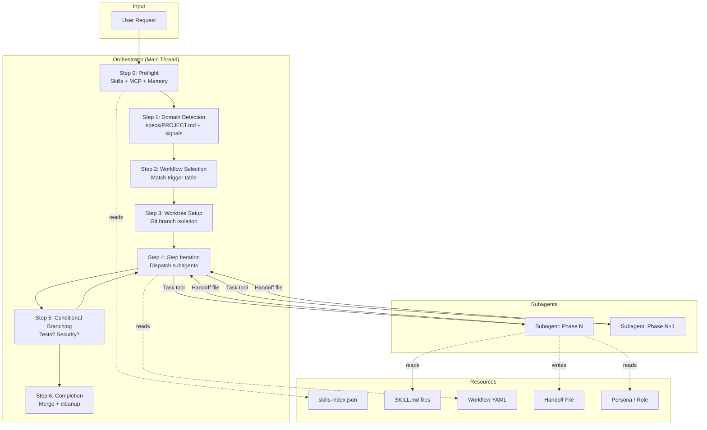

## Workflow Pipelines

### Feature Implementation

The most comprehensive workflow. All others are subsets of this pattern.

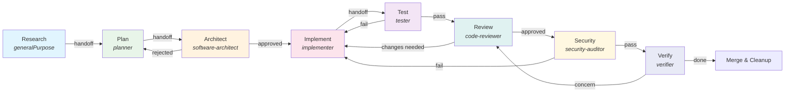

**Skills loaded per phase:**

| Phase | Subagent | Skills |
|-------|----------|--------|
| Research | generalPurpose | common-best-practices, common-context-optimization |
| Plan | planner | common-product-requirements, common-system-design |
| Architect | software-architect | common-architecture-diagramming, common-system-design |
| Implement | implementer | common-best-practices, common-error-handling |
| Test | tester | common-tdd |
| Review | code-reviewer | common-code-review, common-security-standards |
| Security | security-auditor | common-security-audit, common-security-standards |
| Verify | verifier | common-protocol-enforcement, knowledge-audit |

### Bugfix

Similar to feature but starts with research + exploration instead of planning.

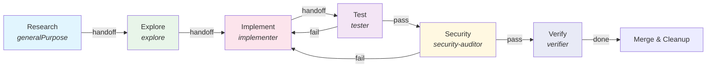

### Explore and Plan

Read-only workflow for understanding a codebase before committing to implementation.

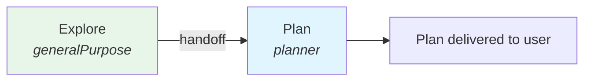

### Cross-Domain (Backend + Infra)

For tasks that span application code and infrastructure (e.g., deploy a new service).

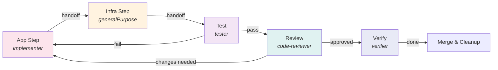

### Security / DevSecOps Audit

Standalone security assessment pipeline.

```mermaid
graph LR
    RC[Recon<br/><i>security-auditor</i>] -->|handoff| SA[SAST<br/><i>security-auditor</i>]
    SA -->|handoff| DS[Dependency Scan<br/><i>security-auditor</i>]
    DS -->|handoff| SD[Secret Detection<br/><i>security-auditor</i>]
    SD -->|handoff| DP[DAST Probe<br/><i>security-auditor</i>]
    DP -->|handoff| EV[Exploit Validation<br/><i>security-auditor</i>]
    EV -->|handoff| RP[Report<br/><i>security-auditor</i>]
    RP --> DONE[Report delivered]

    style RC fill:#fff8e1
    style SA fill:#fff8e1
    style DS fill:#fff8e1
    style SD fill:#fff8e1
    style DP fill:#fff8e1
    style EV fill:#fff8e1
    style RP fill:#fff8e1
```

### Dart/Flutter Release

Gather release info, generate notes, and verify before publishing.

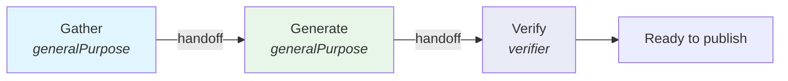

## Skill Discovery Flow

When no workflow matches (ad-hoc tasks), the agent discovers skills dynamically:

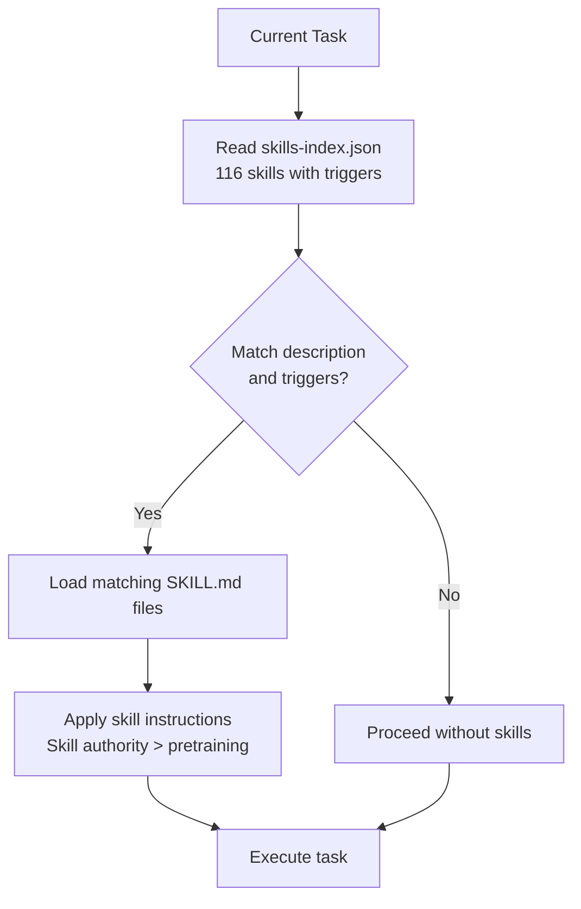

**How matching works:**

Each skill in `skills-index.json` has:
- `description` — what the skill does (natural language)
- `triggers` — keywords and file glob patterns (e.g. `**/*.dart, flutter, bloc, state management`)

The agent compares the user's request and current file context against these fields. Multiple skills can match simultaneously.

## Subagent Delegation

The orchestrator delegates to subagents via the **Task tool**. Each subagent runs in isolation with no chat context — it receives everything through its prompt.

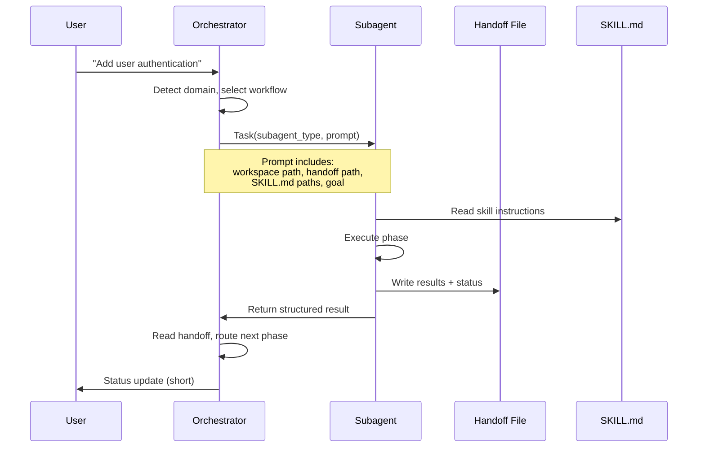

**Every subagent prompt must include:**
1. Workspace root (absolute path)
2. Handoff file path
3. SKILL.md paths to read first
4. Goal and constraints
5. Required return format

**Subagent return format:**
```
## Result
- Status: (success | partial | blocked)
- Executive summary: (1-3 sentences)
- Summary: (max 5 bullet points)
- Handoff: (path to updated handoff file)

## Artifacts
- Files touched: (paths)
- Commands run: (or "none")

## Routing
- Next recommended: (workflow step)
- Blocked: (yes/no)
- Risks: (or "none")
```

## Handoff Protocol

Handoff files are the communication channel between workflow phases. They live at `.agent-output/handoff-<branch>.md` and contain structured fields that each phase reads and updates.

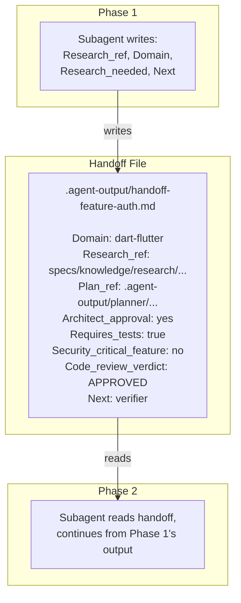

**Key handoff fields:**

| Field | Set by | Purpose |
|-------|--------|---------|
| `Domain` | Orchestrator | Detected technology domain |
| `Research_ref` | Research phase | Path to research document |
| `Plan_ref` | Plan phase | Path to plan document |
| `Architect_approval` | Architect | yes/no |
| `Requires_tests` | Planner | Whether test phase runs |
| `Security_critical_feature` | Planner | Whether security audit runs |
| `Code_review_verdict` | Reviewer | APPROVED / REQUIRES_CHANGES |
| `Blocked` | Any phase | true if phase cannot proceed |
| `Return_to_step` | Any phase | Which phase to retry |

**Lifecycle:** Handoff files are created when a workflow starts and **deleted** when the workflow completes successfully.

## Conditional Branching

Workflows support dynamic routing based on handoff fields:

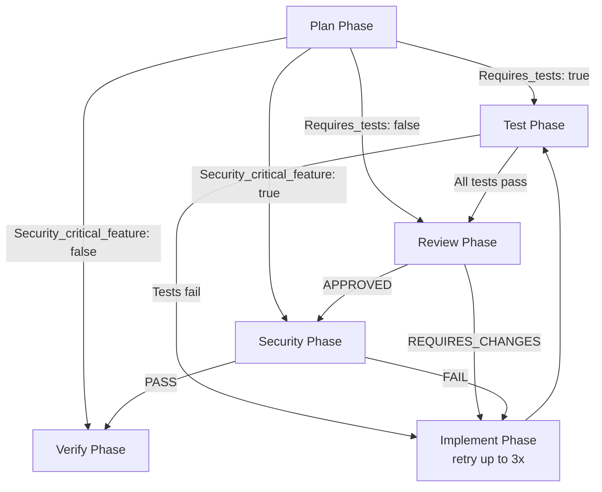

**Retry policy:** Each phase can retry up to 3 times when blocked. If retries are exhausted, the workflow stops and reports to the user.

## Domain Detection

The orchestrator determines the technology domain to select the right personas and domain-specific commands:

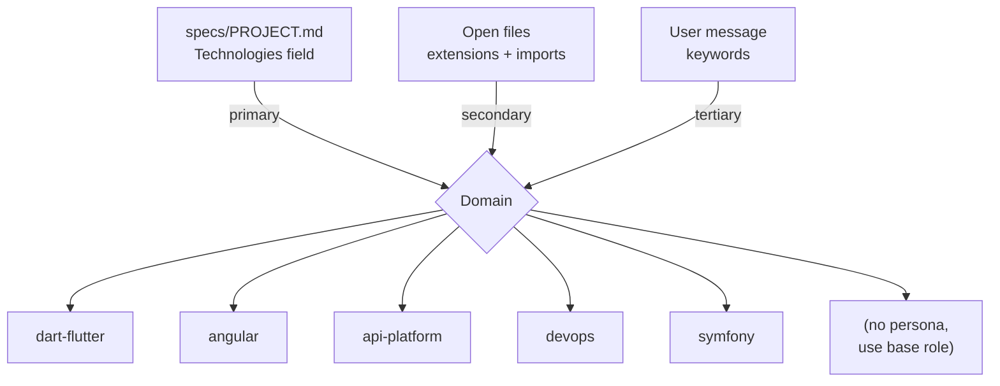

Once detected, the domain is used to:
- Load domain-specific **personas** (`agents/personas/{role}-{domain}.md`)
- Apply **domain commands** from `workflows/_domain-commands.yaml`
- Pass `{{domain}}` to workflow templates

## Workflow YAML Structure

Each workflow file follows the contract in `workflows/WORKFLOW_CONTRACT.md`:

```yaml
name: feature-implementation          # Stable ID
description: "..."                     # Human summary
domain: "{{domain}}"                   # Placeholder or fixed
trigger: "User asks to..."            # When orchestrator selects this
prerequisites: []                      # Optional
steps:
  - id: research                       # Phase ID
    subagent_type: generalPurpose      # Which role to use
    skills:                            # Skills to load
      - common-best-practices
      - common-context-optimization
    entry_criteria: "..."              # What must be true to start
    exit_criteria: "..."               # What must be true to finish
    handoff_to: plan                   # Next phase
    on_concern_return_to: null         # Where to go if blocked
    prompt_template: |                 # Template for subagent prompt
      Workspace: {{workspace}}. Domain: {{domain}}.
      Goal: {{user_goal}}.
      ...
```

## Token Economics

The orchestrator manages context window usage following `rules/100-token-economics.mdc`:

- The **main thread** stays minimal: routing, workflow selection, short user updates
- **Subagents** hold execution context (code, diffs, test output)
- Broad exploration (many file reads, wide globs) always goes to a subagent
- Handoff files and `.agent-output/` directories carry context between phases instead of chat history

## Quick Reference

| Resource | Path |
|----------|------|
| Skills index | `skills-index.json` |
| Skills root | `skills/` |
| Workflows | `workflows/` |
| Workflow contract | `workflows/WORKFLOW_CONTRACT.md` |
| Agent roles | `agents/roles/` |
| Agent personas | `agents/personas/` |
| Orchestration rules | `rules/010-orchestrator.mdc` |
| Delegation rules | `rules/050-subagent-delegation.mdc` |
| Handoff protocol | `rules/051-handoff-protocol.mdc` |
| Token economics | `rules/100-token-economics.mdc` |
| Kit architecture | `rules/016-kit-architecture.mdc` |
